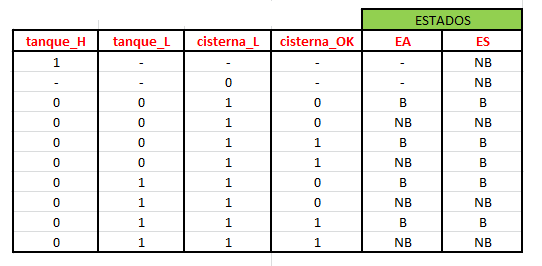

# Informe de Desarrollo de un Controlador Digital de Bomba de Agua

Electrónica IV - Trabajo Práctico Nº1 - 2024 - Automatismos y Máquinas Elementales

## Introducción

Se quiere diseñar un "**Controlador de Bomba de Agua**", adecuado al siguiente funcionamiento: Se cuenta con una instalación de agua corriente en la cual hay una cisterna, un tanque elevado y una bomba de agua que permite impulsar el agua desde la cisterna hacia el tanque. Con tal propósito, se instalaron 2 sensores en la cisterna y dos sensores en el tanque que se activan (es decir, producen un nivel alto de tensión), cuando el nivel de agua se encuentra se encuentra a su altura (o a una altura superior).

En la siguiente tabla se describe, brevemente, el funcionamiento de cada uno de los sensores:

El obejtivo del controlador de bomba de agua será, entonces, mantener el nivel de agua en el tanque siempre por encima del mínimo nivel especificado por el sensor *tanque_L*, pero a lo sumo hasta llenar el tanque, procurando que no se rebalse. Además. el controlador debe ser capaz de evitar que la bomba se descebe, apagándose si en la cisterna no hay el nivel necesario para bombear el agua.

  **NOTA:**Las bombas de agua se desceban cuando el sistema de bombeo sufre una entrada de aire, ya sea debido a fugas en la tubería, problemas con el sello de la bomba o niveles de agua insuficientes en la fuente de succión. Ésto puede producir desde una reducción en la capacidad de bombeo hasta daños en la bomba o el motor.

## Metodología de trabajo

Para comenzar con el diseño del controlador de la bomba de agua, en primera instancia se alanizaron algunos aspectos importantes de su funcionamiento, que se deben tener en cuenta. En los siguientes párrafos se exponen algunas de éstas consideraciones:

- La cisterna cuenta con 2 sensores:
  1) *cisterna_L* : Toma el valor 1 cuando el nivel de agua de la cisterna se encuentra al menos a la altura del sensor, y 0 en otro caso. Debajo de este nivel, la Bomba de Agua NO PUEDE ESTAR ENCENDIDA, AUN CUANDO EL TANQUE NO TENGA EL NIVEL DE AGUA DESEADO. Ésto es porque si la cisterna no está llena por lo menos hasta este nivel y se extrae agua de ella para bombearla al tanque, la bomba puede descebarse.
  2) *cisterna_OK* : Toma el valor 1 cuando el nivel de agua de la cisterna se encuentra al menos a la altura del sensor, y 0 en otro caso. Si está en valor alto, significa que la cisterna posee el nivel de agua suficiente para empezar a bombear. Ésto NO implica que siempre que *cisterna_OK* sea 0, no se pueda bombear, pues si la bomba ya estaba funcionando (pues en algún momento anterior se alcanzó el nivel de agua necesario para COMENZAR a bombear), naturalmente se descargará y bajará del nivel del sensor y sin embargo deberá seguir bombeando hasta que se llene el tanque, o en su defecto, hasta que el cisterna_L tome el valor 0.

- El tanque cuenta con 2 sensores:
  1) *tanque_L* : Toma el valor 1 cuando el nivel de agua deL tanque se encuentra al menos a la altura del sensor, y 0 en otro caso. Si el agua en el tanque se encuentra por debajo de este nivel, será necesario llenar el tanque. Sin embargo, notemos que ésto NO SIEMPRE ES POSIBLE, pues se debe evitar que se descebe la bomba, como se explicó anteriormente.
  2) *tanque_H* : Toma el valor 1 cuando el nivel de agua deL tanque se encuentra al menos a la altura del sensor, y 0 en otro caso. Es el máximo nivel de agua que puede alcanzar el tanque sin rebalsar. Luego, notamos que si el tanque se llena, NECESARIAMENTE SE DEBE APAGAR LA BOMBA, independientemente de si la cisterna cuenta con el nivel de agua suficiente para emplezar a bombear, pues de lo contrario, se rebalsaría y se desperdiciaría agua.

---------------------------------------------------------------------------------------------------------------

Con todo lo anterior en mente, se puede comenzar con el diseño de la bomba. Para su implementación, se optó por un diseño como una ***Máquina de Estado Finito***, puesto que solo deberá contar con 2 estados, lo cual implica el uso de un solo elemento de memoria (Flip Flop) y será relativamente sencillo de diseñar. Definimos los estados de la máquina como sigue:

*Estado B*: Si la máquina se encuentra en este estado, entonces, la bomba de agua debe estar en funcionamiento.
*Estado NB*:  Si la máquina se encuentra en este estado, entonces, la bomba de agua debe estar Apagada.

Una vez definidos los estados posibles, procederemos a realizar la tabla de transición, en la que se establece cual deberá ser el "estado siguiente" de la máquina, en función de cual es su "estado actual" y de los valores de las señales de entrada (que son los sensores). Sin embargo, ello implicaría realizar una tabla con 32 filas, lo cual es tedioso, de modo que para reducir la tabal, se tuvo en cuenta lo siguiente:
- Si *tanque_h* = 1, entonces el tanque se llenó  y el Estado Siguiente debe ser que se apague la bomba, independiemtemente de los valores de las restantes señales.
- Si *cisterna_L* = 0, entonces no se tiene el nivel de agua suficiente en la cisterna para bombear, por lo que el Estado Siguiente debe ser que se apague la bomba, independiemtemente de los valores de las restantes señales.

Con todo lo anterior se obtiene la siguiente tabla:

Por otro lado, hacemos la siguiente asiganación de los estados:
- Si EA = B entonces asignamos *bomba_act* = 1.
- Si EA = NB entonces asignamos *bomba_act* = 0.
- Si ES = B entonces asignamos *bomba_sig* = 1.
- Si ES = NB entonces asignamos *bomba_sig* = 0.
Y consideraremos como la salida a una señal *bomba* que se conecta directamente a *bomba_act* y toma el valor 1, si se debe encender la bomba y 0, si se debe apagar. Luego, la tabla de Transición con entradas y salida será:

Podemos escribir la lógica de estado siguiente a partir de la tabla anterior, para escribir *bomba_sig* como función de *bomba_act* y de las entradas. Para ello, escribiremos la funcióm en su forma canónica de suma de productos llegando a:

Donde por simplicidad, se consideró lo siguiente:

## Resultados

Podemos implementar la función anterior, usando compuertas lógicas y un FlipFlop tipo D, como se muestra en la siguiente imagen:

**Nota:** Con el fin de obtener un esquemático más comprensible y prolijo, se optó por incorporar compuertas NOT en cada una de las entradas de las compuertas OR en las que las señales deben aparecer negadas. En la realidad, lo más prudente sería tener cables con cada uno de los valores de las señales y las señales negadas, y simplemente conectar a las compuertas las que correspondan.

## Conclusiones

Se realizó una simulación de del circuito anterior, empleando el programa *Digital* y se concluyó que el mismo funciona de acuerdo a lo esperado.

*¿Qué tipo de Máquina es el Controlador de Bomba de Agua?*
Para responder esta pregunta, debemos tener en cuenta la siguiente:

- **AUTOMATISMO:** Un automatismo es un elemento que es capaz de ejecutar alguna secuencia de operaciones sin la necesidad de una intervención manual. Los automatismos están diseñados para realizar tareas específicas de forma repetitiva y predecible, siguiendo un conjunto de instrucciones o reglas preestablecidas.
- **MÁQUINA ELEMENTAL:** Una máquina elemental es un dispositivo mecánico simple que realiza una función básica o elemental. No necesariamente implica la automatización.Las máquinas elementales generalmente tienen una funcionalidad específica.
- **COMPUTADORA:** Una computadora es una máquina que es capaz de realizar varias tareas y puede cambiar de programa. 

Con todo lo anterior, podemos clasificar al controlador de bomba de agua como una *Máquina Elemental*.

