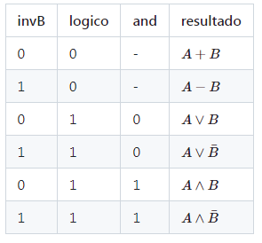
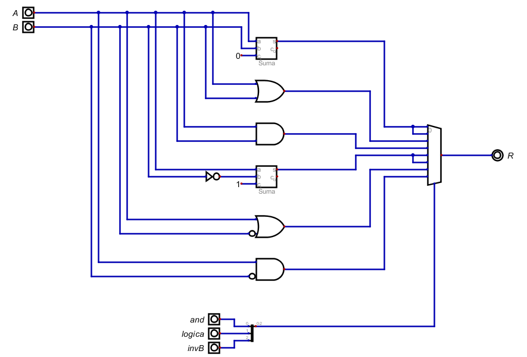

# Informe de Desarrollo de una Unidad Aritmética Lógica (ALU) de 16 bits

Electrónica IV - Trabajo Práctico Nº1 - 2024 - Automatismos y Máquinas Elementales

## Introducción

Se quiere diseñar una **ALU (Unidad Aritmética Lógica)**, la cual se entiende como un elemento cuya función principal es realizar operaciones aritméticas y lógicas en datos que son enviados desde y hacia la memoria de una determinada máquina.

En particular, en este caso, se tendrán 2 entradas (A y B), cada una de 16 bits, y la ALU posee 6 modos de operación, los cuales dependen de tres señales de 1 bit que se usan como selectoras 
*invB:* Invierte la señal B, cuando toma el valor 1 y NO invierte a B si su valor es 0; 
*logico:* Si su valor es 0, se realiza una operación aritmética entre A y B, y sis u valor es 1, se realiza una operación lógica; 
*and:* Si su valor es 1 se hace una operación de AND entre A y B, y si su valor es 0, se hace una OR (siempre que *logico = 1*).

En conclusión, se debe diseñar una ALU que tenga las siguientes configuaraciones para las señales de control, que permiten ejecutar cada una de las operaciones soportadas por la ALU:

## Metodología de trabajo

En este caso, el diseño del esquemático es sencillo: Constará de un multiplexor (que hará las veces de un *"if"*), cuya señal de selección será la concatenación de *invB* & *logico* & *and*. Luego, la salida "*R*", tomará el valor de la suma, resta, AND u OR de las entradas, en función del valor de la señal de selección (de 3 bits), de acuerdo a la tabla expuesta en la sección anterior

Luego, simplemente, debemos diseñar los bloques que realizan las operaciones soportadas por la ALU. Sin embargo, éstas operaciones son elementales y el simulador *Digital* ya cuenta con bloques específicos para realizar dichas tareas. A continuación se comenta brevemente el diseño:

- **OPERACIONES LÓGICAS:** Simplemente constan de compuertas AND y OR, en las cuales una de las entradas (señal B) puede o no estar negada, de acuerdo al valor de *invB*.
- **BLOQUE SUMADOR:** El simulador cuenta con un sumador. La única observación que se debe hacer es que en la entrada C del mismo, se debe colocar un valor constante de 0 para que no se afecte el resultado de la suma, según se explica en la descripción del propio componente.
- **BLOQUE RESTADOR:** Para implementar el restador, consideraremos que podemos obtener A-B, sumandole a A el *Complemento a 2 de la señal B*. Luego, recordando que el complemento a 2 de un número binario puede encontrarse intercambiando todos los 1 por 0 y los 0 por 1 (es decir, una NOT) y al resulatdo sumarle 1. Así, podemos escribir lo siguiente:

                                A - B = A + C2(B) = A + (not B + 1)

De modo que podemos diseñar el restador usando el bloque sumador en el cual se ingresa la señal A, la señal B negada, y se coloca la entrada C del componente a un valor constante de 1.

## Resultados

A continuación se expone el esquemático correspondiente a las especificaciones anteriores:

Notamos que el multiplexor permite como señal selectora a UNA señal de 3 bits y NO a 3 señales de 1 bit cada una (como es en este caso). Luego, para salvar esta situación, simplemente se realiza una concatenación de las 3 señales *invB*, *logico*, *and*, con el componente Divisor/Agregador proporcionado por el programa

## Conclusiones

Se realizó una simulación del esquemático de la ALU con el programa *Digital* y se comprobó que la misma funciona correctamente de acuerdo a las especificaciones.

*¿Qué tipo de Máquina es la Unidad Aritmética Lógica?*
Para responder esta pregunta, debemos tener en cuenta la siguiente:

- **AUTOMATISMO:** Un *Automatismo* es un elemento que es capaz de ejecutar alguna secuencia de operaciones sin la necesidad de una intervención manual. Los automatismos están diseñados para realizar tareas específicas de forma repetitiva y predecible, siguiendo un conjunto de instrucciones o reglas preestablecidas. También llamadas *Autómatas*, son máquinas capaces de realizar una secuencia de operaciones en forma automática (Por ejemplo, una Máquina de Estado Finito) y pueden ser sistemas de control de algún dispositivo y/o contar con cierta clase de progaramción primitiva.
- **MÁQUINA ELEMENTAL:** Una *Máquina Elemental* es una máquina capaz de realizar cálculos aritméticos y/o operaciones lógicas. No necesariamente implica la automatización de esos cálculos, y generalmente debe contar con la posibilidad de introducir los datos de entrada y ver la información de salida (aunque ésto no es estrictamente necesario). El ejemplo más común de una Máquina Elemental es una Calculadora.
- **COMPUTADORA:** Una *Computadora* es una Máquina (electrónica y digital), que es capaz de realizar varias tareas, ejecutando una serie de instrucciones provenientes de un Programa (CPU), a través de una Unidad Central de Procesamiento que recibe datos de entrada, los cuales traslada, almacena y procesa para convertirlos en información que posteriormente se envía a los puertos de salida. Además una computadora puede Cambiar de programa (es decir, si se cambian las instrucciones, la computadora cambia de tarea). 

De todo lo anterior, se puede concluir que una ALU es una *Máquina Elemental* pues está diseañada para la realización de cálculos aritméticos y operaciones lógicas. Generalmente, una ALU es una parte de una máquina elemental, la cual suele contar, además, con algún elemento de memoria y una manera de ingresar datos y visualizar el resultado. Sin embargo, de acuerdo a la definición, 1) NO toda máquina elemental debe contar con una ALU ni hacer los cálculos de manera automática, y 2) NO es condición necesaria que la máquina sea capaz de ingresar datos y mostrar los resultados, por lo que la ALU por sí misma puede considerarse como un ejemplo (no muy bueno) de una Máquina Elemental.